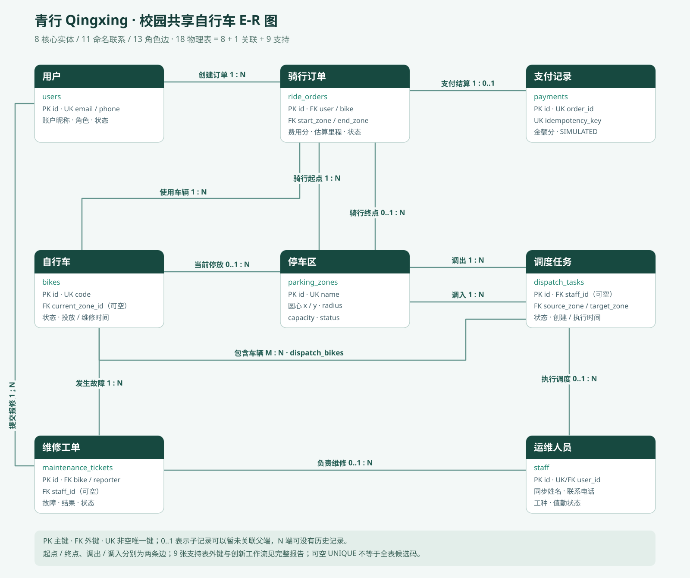
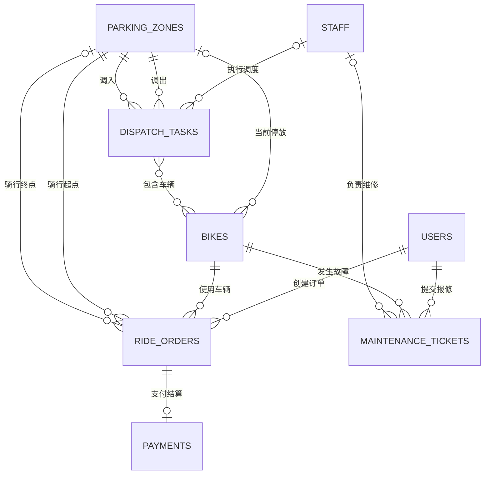

# 青行 Qingxing · 校园共享自行车系统数据库课程设计报告

**小组：贾鑫洋、欧阳晨、郑一凡、王奕**  
**交付日期：2026 年 10 月 4 日**  
**实现环境：MySQL 8.0.16+ / InnoDB，Node.js，Express，React，TypeScript，Vite**

## 1. 摘要与需求依据

本项目针对校园早晚高峰缺车、停车区满位、故障响应滞后及绿色出行反馈不足的问题，设计从注册登录、借车、归还、模拟支付到调度和维修的关系数据库系统。八个核心业务实体形成十一项命名联系（十三条角色边）；任务车辆关联表实现多对多，另设七张分析与审计支持表，共十六表、三视图、两触发器、一存储过程。前端展示业务状态和数据库结构，后端执行业务事务，数据库负责持久化与结构约束。

需求来源为当前任务提供的截图要求、可取得的聊天缓存摘要、旧课程报告和实际仓库。引用 ChatGPT 会话的完整正文、课程 PPT 原文在本次环境不可取得；本报告不声称逐页核对，也不自行编造评分细则。旧报告仅沿用四人名单与分工框架，交易与钱包业务已全部改为校园自行车业务。

## 2. 需求分析与系统边界

学生需要查看各停车区可借车辆、借用车辆、选择归还停车区并完成支付，也可提交故障报修。管理员负责车辆、停车区、员工、账户状态及任务分配；运维人员处理本人被分配的调度和维修。分析模块辅助观察热点、调度建议、风险及绿色出行记录。

本地地图参考北京航空航天大学官网发布的学院路校区平面图，整理主楼、图书馆、合一楼、新主楼、体育馆等建筑和道路的相对方位；系统使用米制示意坐标，并以圆形围栏模拟停车范围。建筑轮廓、停车点和路网并非测绘成果，不能作为 GPS 地图或真实导航。支付是 SIMULATED，不连接银行、第三方支付或真实资金。碳减排是按固定系数估算的教学指标，不构成碳核证。系统不包含智能硬件开锁、实时轨迹和机器学习预测。

| 需求 | 输入与输出 | 主要约束 |
|---|---|---|
| 注册与登录 | 姓名、邮箱、电话、密码；登录身份 | 邮箱与电话唯一；注册仅学生；密码保存摘要 |
| 借车 | 车辆编号；运行中订单 | 用户和车辆各最多一笔运行中订单；车辆可借且站点开放 |
| 归还 | 站点、平面坐标、路线偏好；费用及估算里程 | 围栏内且容量含预留后仍有空位；服务器计费 |
| 支付 | 订单与幂等键；唯一支付记录 | 仅本人未付订单；金额匹配；重复请求不重复记账 |
| 调度 | 源站、目标站、车辆集合、员工；任务状态 | 两站不同；不超过可用车和目标空位；锁定车辆和车位 |
| 维修 | 车辆、故障类型、描述；分配与处理结果 | 同车仅一个未完成工单；完成必须有员工、结果和时间 |
| 运营分析 | 7/30 日、周/月等窗口；图表与可解释建议 | 数据覆盖率可见；权限控制；榜单姓名脱敏 |

## 3. 架构与业务生命周期

```text
React / TypeScript 页面 → HTTP JSON / Cookie → Express
  → 身份鉴别、角色授权、参数校验、分析函数
  → 命名锁 + InnoDB 事务 + SELECT ... FOR UPDATE
  → MySQL：16 表、3 视图、2 触发器、1 存储过程
```

订单 RUNNING → UNPAID → PAID。借车使 AVAILABLE → RIDING，当前位置变空；归还使 RIDING → AVAILABLE 并登记目标站。报修后车辆进入 MAINTENANCE，维修完成重新可用；报废 RETIRED 不参与借车。调度 PENDING → IN_PROGRESS → COMPLETED，也可取消为 CANCELLED。创建任务即将车改为 DISPATCHING，待处理阶段仍在源站；出发后当前位置为空，完成后落在目标站。待处理和进行中任务均为目标站预留位置，归还必须计算 occupied + reserved，取消也须验证回源站容量。

时间持久化为 UTC DATETIME(3)，运营统计按北京时间解释小时与周/月边界。费用使用整数分：每开始 30 分钟 100 分，至少 100 分，避免浮点金额误差。归还里程由服务器路网算法重新计算，distance_source 固定 ROUTE_ESTIMATE，不能将浏览器传入的里程当可信依据。

## 4. 概念结构：八实体与十一项命名联系



| 实体 | 关系表 | 业务职责 |
|---|---|---|
| 用户 | users | 骑行身份、账户角色及状态 |
| 自行车 | bikes | 编号、投放、位置与车辆状态 |
| 停车区 | parking_zones | 校园地点、围栏与容量 |
| 骑行订单 | ride_orders | 使用记录、起终点、时间、费用及状态 |
| 支付记录 | payments | 订单模拟支付及幂等凭据 |
| 运维人员 | staff | 绑定账户、工种及值勤状态 |
| 调度任务 | dispatch_tasks | 调入调出站、员工与执行进度 |
| 维修工单 | maintenance_tickets | 故障、分配与维修结果 |

| 编号与命名联系 | 两端与基数 | 外键/实现 |
|---|---|---|
| 1 创建订单 | 用户 1 : N 订单 | ride_orders.user_id |
| 2 使用车辆 | 单车 1 : N 订单 | ride_orders.bike_id |
| 3 当前停放 | 停车区 1 : N 单车 | current_zone_id；骑行/运输中为空 |
| 4 骑行起点/终点 | 停车区到订单分别 1 : N | start_zone_id / end_zone_id；两条角色边 |
| 5 支付结算 | 订单 1 : 0..1 支付 | payments.order_id 非空唯一 |
| 6 执行调度 | 运维 1 : N 调度 | staff_id，待分配可空 |
| 7 调出/调入 | 停车区到调度分别 1 : N | source_zone_id / target_zone_id；两条角色边 |
| 8 包含车辆 | 调度 M : N 单车 | dispatch_bikes(task_id,bike_id) |
| 9 提交报修 | 用户 1 : N 维修工单 | reporter_id |
| 10 发生故障 | 单车 1 : N 维修工单 | bike_id |
| 11 负责维修 | 运维 1 : N 维修工单 | staff_id，待分配可空 |

截图中的十一项是命名行口径，其中起点/终点及调出/调入分别包含两个独立角色，因此 E-R 图实际绘制十三条联系边。员工绑定账户是补充物理外键。父实体可以没有历史子记录；每条订单、工单等的必要父实体由非空外键规定。



## 5. 逻辑结构与规范化

八个核心实体分别转为主键 id 的表；调度任务与车辆的多对多转为复合主键 (task_id,bike_id) 的关联表。支持表为 zone_snapshots（库存采样）、return_attempts（拒绝归还记录）、road_nodes（路网点）、road_edges（路网边）、carbon_ledger（支付后绿色积分）、audit_logs（审计）和 system_settings（配置）。八 + 一 + 七 = 十六，关联表与支持表不冒充新增核心业务实体。

| 关系 | 候选码（基于非空唯一约束） | 主要函数依赖 |
|---|---|---|
| users | id；email；phone | 每个候选码 → 其余属性 |
| parking_zones | id；name | id/name → 位置、容量、状态等 |
| bikes | id；code | id/code → 投放、状态、当前位置、维修时间 |
| ride_orders | id | id → 用户、车、起终点、时间、费用、里程、状态 |
| payments | id；order_id；idempotency_key | 各码 → 金额、时间、方式等 |
| staff | id；user_id | id/user_id → 员工姓名、电话、工种、状态 |
| dispatch_tasks | id | id → 员工、两站、状态、时间 |
| dispatch_bikes | (task_id,bike_id) | 复合码确定唯一关联，无非键属性 |
| maintenance_tickets | id | id → 车、报修人、员工、故障和处理信息 |
| zone_snapshots / return_attempts / audit_logs | 各自 id | id → 对应记录属性 |
| road_nodes | id | id → 名称、坐标、可选站点 |
| road_edges | id；(from_node_id,to_node_id) | 各码 → 距离、安全及舒适权重 |
| carbon_ledger | id；order_id | id/order_id → 距离、积分、减排、系数、时间 |
| system_settings | name | name → value |

不能把可空 UNIQUE 当作全关系上的候选码：road_nodes.zone_id 可有多个 NULL；订单 active_user/active_bike、维修 active_bike 是状态条件下生成且可空的唯一约束，只限制活动子集，不是所有历史记录的候选码。用户名、员工电话、快照 (zone_id,captured_at) 没有相应非空唯一约束，不自行假设为键。

对非派生的业务事实，属性原子化、复合键无部分依赖，非键属性由候选码决定；在以上明确列出的键依赖模型下达到 3NF/BCNF。该结论不能机械推广到实际全部列：active_user 等生成列由 status、user_id 派生，严格把这些派生约束当函数依赖时会产生非超码决定关系，完整物理表不能无条件声称 BCNF。carbon_ledger 中积分和减排由距离、当时规则生成，若规则固定并视为永久函数依赖，也存在非码依赖；这是可追溯记账快照的有意冗余，计算写入时校验、支付后不回算历史。库存快照 capacity 则表示采样时容量，不等于停车区当前容量，不产生跨时间的 zone_id → 历史 capacity 依赖。

staff.name/phone 为运维档案显示字段，users.name/phone 为认证账户联系字段；当前实际 saveStaff 实现会在同一事务中创建或更新两表的同名同电话，因此它们是有意保留的同步联系信息副本，并非可分别修改的独立当前值，也不是历史快照。账户身份、邮箱和登录密码以 users 为规范来源；工种与值勤状态以 staff 为规范来源。保留副本方便运维记录展示，但带来跨表更新一致性责任：必须通过同一服务事务维护，直接 SQL 单边更新可能漂移，可通过 staff JOIN users 对比审计。staff.phone 自身未声明唯一，不能单凭字段名假定为候选码；通过账户唯一电话与同步规则产生的额外业务限制应明确区分于表级约束。每表在所列键依赖下的规范化分析不等于消除了跨表冗余，更不能用“独立信息”解释当前同步写入来无条件宣称全局 BCNF。若追求严格消除该冗余，应删掉 staff 姓名/电话并 JOIN users，这属于后续模式调整，不是当前实现。

## 6. 完整数据字典

以下字段定义由 database/schema.sql 的 CREATE TABLE 提取，类型、可空、默认、生成表达式与键以原始 DDL 为准。金额单位分，距离与坐标单位米，所有 *_at 时间为 UTC。id 为无符号自增主键；*_id 为关联编号；status 为所属表状态域；name 为名称；其他语义见各表职责、字段名称及 DDL 中 ENUM/CHECK。完整字段约束直接列出，避免报告与源码漂移。

### users

| 字段 | SQL 类型与完整列约束 | 含义 |
|---|---|---|
| `id` | `BIGINT UNSIGNED AUTO_INCREMENT PRIMARY KEY` | 唯一记录编号 |
| `name` | `VARCHAR(40) NOT NULL` | 名称；users为账户昵称，staff为档案姓名 |
| `email` | `VARCHAR(160) NOT NULL UNIQUE` | 登录邮箱 |
| `phone` | `VARCHAR(20) NOT NULL UNIQUE` | 账户电话；staff中为同步联系副本 |
| `password_hash` | `VARCHAR(100) NOT NULL` | 密码摘要，禁止返回接口 |
| `role` | `ENUM('STUDENT','ADMIN','OPERATOR') NOT NULL DEFAULT 'STUDENT'` | 学生/管理员/运维账户角色 |
| `status` | `ENUM('ACTIVE','SUSPENDED') NOT NULL DEFAULT 'ACTIVE'` | 本表业务状态 |
| `created_at` | `DATETIME(3) NOT NULL DEFAULT CURRENT_TIMESTAMP(3)` | 创建时间（UTC） |

### parking_zones

| 字段 | SQL 类型与完整列约束 | 含义 |
|---|---|---|
| `id` | `BIGINT UNSIGNED AUTO_INCREMENT PRIMARY KEY` | 唯一记录编号 |
| `name` | `VARCHAR(60) NOT NULL UNIQUE` | 名称；users为账户昵称，staff为档案姓名 |
| `location` | `VARCHAR(160) NOT NULL` | 校园位置文字说明 |
| `x` | `DECIMAL(10,2) NOT NULL` | 米制平面横坐标 |
| `y` | `DECIMAL(10,2) NOT NULL` | 米制平面纵坐标 |
| `radius` | `DECIMAL(8,2) NOT NULL DEFAULT 45` | 围栏半径（米） |
| `capacity` | `INT NOT NULL` | 停车容量；快照中为采样当时容量 |
| `status` | `ENUM('ACTIVE','CLOSED') NOT NULL DEFAULT 'ACTIVE'` | 本表业务状态 |

表级约束与索引：

```sql
CHECK(capacity BETWEEN 1 AND 1000),
CHECK(radius>0),
CHECK(x BETWEEN 0 AND 2000),
CHECK(y BETWEEN 0 AND 2000)
```

### bikes

| 字段 | SQL 类型与完整列约束 | 含义 |
|---|---|---|
| `id` | `BIGINT UNSIGNED AUTO_INCREMENT PRIMARY KEY` | 唯一记录编号 |
| `code` | `VARCHAR(30) NOT NULL UNIQUE` | 唯一单车编号 |
| `deployed_at` | `DATE NOT NULL` | 车辆投放日期 |
| `status` | `ENUM('AVAILABLE','RIDING','MAINTENANCE','DISPATCHING','RETIRED') NOT NULL DEFAULT 'AVAILABLE'` | 本表业务状态 |
| `current_zone_id` | `BIGINT UNSIGNED NULL` | 当前停车区；骑行/运输中可空 |
| `last_service_at` | `DATETIME(3) NULL` | 最近维修时间（UTC） |

表级约束与索引：

```sql
FOREIGN KEY(current_zone_id) REFERENCES parking_zones(id),
INDEX idx_bike_zone_status(current_zone_id,status),
CHECK(status<>'AVAILABLE' OR current_zone_id IS NOT NULL),
CHECK(status<>'RIDING' OR current_zone_id IS NULL)
```

### ride_orders

| 字段 | SQL 类型与完整列约束 | 含义 |
|---|---|---|
| `id` | `BIGINT UNSIGNED AUTO_INCREMENT PRIMARY KEY` | 唯一记录编号 |
| `user_id` | `BIGINT UNSIGNED NOT NULL` | 所属或绑定账户编号 |
| `bike_id` | `BIGINT UNSIGNED NOT NULL` | 关联车辆编号 |
| `start_zone_id` | `BIGINT UNSIGNED NOT NULL` | 骑行起点停车区 |
| `end_zone_id` | `BIGINT UNSIGNED NULL` | 骑行终点，运行中为空 |
| `started_at` | `DATETIME(3) NOT NULL DEFAULT CURRENT_TIMESTAMP(3)` | 开始时间（UTC） |
| `ended_at` | `DATETIME(3) NULL` | 骑行结束时间（UTC） |
| `amount_cents` | `INT NOT NULL DEFAULT 0` | 应付/已付金额，整数分 |
| `distance_m` | `INT NOT NULL DEFAULT 0` | 路线估算距离（米） |
| `distance_source` | `ENUM('ROUTE_ESTIMATE') NOT NULL DEFAULT 'ROUTE_ESTIMATE'` | 估算来源标记ROUTE_ESTIMATE |
| `route_mode` | `ENUM('shortest','safe','comfortable') NOT NULL DEFAULT 'shortest'` | 最短/安全/舒适路线偏好 |
| `status` | `ENUM('RUNNING','UNPAID','PAID') NOT NULL DEFAULT 'RUNNING'` | 本表业务状态 |
| `active_user` | `BIGINT UNSIGNED GENERATED ALWAYS AS (CASE WHEN status='RUNNING' THEN user_id END) STORED UNIQUE` | 运行中才生成的用户唯一限制 |
| `active_bike` | `BIGINT UNSIGNED GENERATED ALWAYS AS (CASE WHEN status='RUNNING' THEN bike_id END) STORED UNIQUE` | 活动记录才生成的车辆唯一限制 |

表级约束与索引：

```sql
FOREIGN KEY(user_id) REFERENCES users(id),
FOREIGN KEY(bike_id) REFERENCES bikes(id),
FOREIGN KEY(start_zone_id) REFERENCES parking_zones(id),
FOREIGN KEY(end_zone_id) REFERENCES parking_zones(id),
INDEX idx_ride_start(start_zone_id,started_at),
INDEX idx_ride_end(end_zone_id,ended_at),
INDEX idx_ride_user(user_id,started_at),
CHECK(amount_cents>=0),
CHECK(distance_m>=0),
CHECK((status='RUNNING' AND ended_at IS NULL AND end_zone_id IS NULL) OR (status<>'RUNNING' AND ended_at IS NOT NULL AND end_zone_id IS NOT NULL AND ended_at>=started_at))
```

### payments

| 字段 | SQL 类型与完整列约束 | 含义 |
|---|---|---|
| `id` | `BIGINT UNSIGNED AUTO_INCREMENT PRIMARY KEY` | 唯一记录编号 |
| `order_id` | `BIGINT UNSIGNED NOT NULL UNIQUE` | 关联骑行订单 |
| `idempotency_key` | `VARCHAR(100) NOT NULL UNIQUE` | 支付请求唯一幂等标识 |
| `amount_cents` | `INT NOT NULL` | 应付/已付金额，整数分 |
| `paid_at` | `DATETIME(3) NOT NULL DEFAULT CURRENT_TIMESTAMP(3)` | 支付时间（UTC） |
| `method` | `ENUM('SIMULATED') NOT NULL DEFAULT 'SIMULATED'` | 模拟支付方式 |

表级约束与索引：

```sql
FOREIGN KEY(order_id) REFERENCES ride_orders(id),
CHECK(amount_cents>0)
```

### staff

| 字段 | SQL 类型与完整列约束 | 含义 |
|---|---|---|
| `id` | `BIGINT UNSIGNED AUTO_INCREMENT PRIMARY KEY` | 唯一记录编号 |
| `user_id` | `BIGINT UNSIGNED NOT NULL UNIQUE` | 所属或绑定账户编号 |
| `name` | `VARCHAR(40) NOT NULL` | 名称；users为账户昵称，staff为档案姓名 |
| `phone` | `VARCHAR(20) NOT NULL` | 账户电话；staff中为同步联系副本 |
| `job` | `ENUM('DISPATCH','MAINTENANCE','BOTH') NOT NULL` | 调度/维修/兼任工种 |
| `status` | `ENUM('ACTIVE','OFF_DUTY') NOT NULL DEFAULT 'ACTIVE'` | 本表业务状态 |

表级约束与索引：

```sql
FOREIGN KEY(user_id) REFERENCES users(id)
```

### dispatch_tasks

| 字段 | SQL 类型与完整列约束 | 含义 |
|---|---|---|
| `id` | `BIGINT UNSIGNED AUTO_INCREMENT PRIMARY KEY` | 唯一记录编号 |
| `staff_id` | `BIGINT UNSIGNED NULL` | 执行员工编号，未分配可空 |
| `source_zone_id` | `BIGINT UNSIGNED NOT NULL` | 调出源停车区 |
| `target_zone_id` | `BIGINT UNSIGNED NOT NULL` | 调入目标停车区 |
| `status` | `ENUM('PENDING','IN_PROGRESS','COMPLETED','CANCELLED') NOT NULL DEFAULT 'PENDING'` | 本表业务状态 |
| `created_at` | `DATETIME(3) NOT NULL DEFAULT CURRENT_TIMESTAMP(3)` | 创建时间（UTC） |
| `started_at` | `DATETIME(3) NULL` | 开始时间（UTC） |
| `completed_at` | `DATETIME(3) NULL` | 完成时间（UTC） |

表级约束与索引：

```sql
FOREIGN KEY(staff_id) REFERENCES staff(id),
FOREIGN KEY(source_zone_id) REFERENCES parking_zones(id),
FOREIGN KEY(target_zone_id) REFERENCES parking_zones(id),
CHECK(source_zone_id<>target_zone_id),
CHECK(status<>'IN_PROGRESS' OR (staff_id IS NOT NULL AND started_at IS NOT NULL)),
CHECK(status<>'COMPLETED' OR (staff_id IS NOT NULL AND completed_at IS NOT NULL)),
INDEX idx_dispatch_status(status,created_at)
```

### dispatch_bikes

| 字段 | SQL 类型与完整列约束 | 含义 |
|---|---|---|
| `task_id` | `BIGINT UNSIGNED NOT NULL` | 关联调度任务 |
| `bike_id` | `BIGINT UNSIGNED NOT NULL` | 关联车辆编号 |

表级约束与索引：

```sql
PRIMARY KEY(task_id,bike_id),
FOREIGN KEY(task_id) REFERENCES dispatch_tasks(id),
FOREIGN KEY(bike_id) REFERENCES bikes(id)
```

### maintenance_tickets

| 字段 | SQL 类型与完整列约束 | 含义 |
|---|---|---|
| `id` | `BIGINT UNSIGNED AUTO_INCREMENT PRIMARY KEY` | 唯一记录编号 |
| `bike_id` | `BIGINT UNSIGNED NOT NULL` | 关联车辆编号 |
| `reporter_id` | `BIGINT UNSIGNED NOT NULL` | 提交报修用户 |
| `staff_id` | `BIGINT UNSIGNED NULL` | 执行员工编号，未分配可空 |
| `fault_type` | `ENUM('BRAKE','TIRE','LOCK','CHAIN','OTHER') NOT NULL` | 故障类型 |
| `description` | `VARCHAR(500) NOT NULL` | 故障描述 |
| `status` | `ENUM('OPEN','ASSIGNED','COMPLETED') NOT NULL DEFAULT 'OPEN'` | 本表业务状态 |
| `result` | `VARCHAR(500) NULL` | 维修结果，完成时必填 |
| `created_at` | `DATETIME(3) NOT NULL DEFAULT CURRENT_TIMESTAMP(3)` | 创建时间（UTC） |
| `completed_at` | `DATETIME(3) NULL` | 完成时间（UTC） |
| `active_bike` | `BIGINT UNSIGNED GENERATED ALWAYS AS (CASE WHEN status<>'COMPLETED' THEN bike_id END) STORED UNIQUE` | 活动记录才生成的车辆唯一限制 |

表级约束与索引：

```sql
FOREIGN KEY(bike_id) REFERENCES bikes(id),
FOREIGN KEY(reporter_id) REFERENCES users(id),
FOREIGN KEY(staff_id) REFERENCES staff(id),
INDEX idx_ticket_bike_time(bike_id,created_at),
CHECK(status<>'COMPLETED' OR (result IS NOT NULL AND completed_at IS NOT NULL AND staff_id IS NOT NULL)),
CHECK(status<>'ASSIGNED' OR staff_id IS NOT NULL)
```

### zone_snapshots

| 字段 | SQL 类型与完整列约束 | 含义 |
|---|---|---|
| `id` | `BIGINT UNSIGNED AUTO_INCREMENT PRIMARY KEY` | 唯一记录编号 |
| `zone_id` | `BIGINT UNSIGNED NOT NULL` | 关联停车区 |
| `available` | `INT NOT NULL` | 采样时可借车辆数 |
| `occupied` | `INT NOT NULL` | 采样时在站车辆总数 |
| `capacity` | `INT NOT NULL` | 停车容量；快照中为采样当时容量 |
| `captured_at` | `DATETIME(3) NOT NULL DEFAULT CURRENT_TIMESTAMP(3)` | 库存采样时间（UTC） |
| `source` | `ENUM('LIVE','DEMO') NOT NULL DEFAULT 'LIVE'` | 实时或演示样本来源 |

表级约束与索引：

```sql
FOREIGN KEY(zone_id) REFERENCES parking_zones(id),
INDEX idx_snapshot_zone_time(zone_id,captured_at),
CHECK(available>=0 AND occupied>=available AND capacity>0 AND occupied<=capacity)
```

### return_attempts

| 字段 | SQL 类型与完整列约束 | 含义 |
|---|---|---|
| `id` | `BIGINT UNSIGNED AUTO_INCREMENT PRIMARY KEY` | 唯一记录编号 |
| `order_id` | `BIGINT UNSIGNED NOT NULL` | 关联骑行订单 |
| `zone_id` | `BIGINT UNSIGNED NOT NULL` | 关联停车区 |
| `x` | `DECIMAL(10,2) NOT NULL` | 米制平面横坐标 |
| `y` | `DECIMAL(10,2) NOT NULL` | 米制平面纵坐标 |
| `reason` | `ENUM('OUTSIDE_FENCE','ZONE_FULL','ZONE_CLOSED') NOT NULL` | 拒绝归还原因 |
| `created_at` | `DATETIME(3) NOT NULL DEFAULT CURRENT_TIMESTAMP(3)` | 创建时间（UTC） |

表级约束与索引：

```sql
FOREIGN KEY(order_id) REFERENCES ride_orders(id),
FOREIGN KEY(zone_id) REFERENCES parking_zones(id)
```

### road_nodes

| 字段 | SQL 类型与完整列约束 | 含义 |
|---|---|---|
| `id` | `BIGINT UNSIGNED AUTO_INCREMENT PRIMARY KEY` | 唯一记录编号 |
| `name` | `VARCHAR(60) NOT NULL` | 名称；users为账户昵称，staff为档案姓名 |
| `x` | `DECIMAL(10,2) NOT NULL` | 米制平面横坐标 |
| `y` | `DECIMAL(10,2) NOT NULL` | 米制平面纵坐标 |
| `zone_id` | `BIGINT UNSIGNED NULL UNIQUE` | 关联停车区 |

表级约束与索引：

```sql
FOREIGN KEY(zone_id) REFERENCES parking_zones(id)
```

### road_edges

| 字段 | SQL 类型与完整列约束 | 含义 |
|---|---|---|
| `id` | `BIGINT UNSIGNED AUTO_INCREMENT PRIMARY KEY` | 唯一记录编号 |
| `from_node_id` | `BIGINT UNSIGNED NOT NULL` | 无向边较小编号端点 |
| `to_node_id` | `BIGINT UNSIGNED NOT NULL` | 无向边较大编号端点 |
| `distance_m` | `INT NOT NULL` | 路线估算距离（米） |
| `safety_cost` | `DECIMAL(6,2) NOT NULL DEFAULT 1` | 安全路线附加权重 |
| `comfort_cost` | `DECIMAL(6,2) NOT NULL DEFAULT 1` | 舒适路线附加权重 |

表级约束与索引：

```sql
FOREIGN KEY(from_node_id) REFERENCES road_nodes(id),
FOREIGN KEY(to_node_id) REFERENCES road_nodes(id),
UNIQUE(from_node_id,to_node_id),
CHECK(from_node_id<to_node_id),
CHECK(distance_m>0 AND safety_cost>=1 AND comfort_cost>=1)
```

### carbon_ledger

| 字段 | SQL 类型与完整列约束 | 含义 |
|---|---|---|
| `id` | `BIGINT UNSIGNED AUTO_INCREMENT PRIMARY KEY` | 唯一记录编号 |
| `order_id` | `BIGINT UNSIGNED NOT NULL UNIQUE` | 关联骑行订单 |
| `distance_m` | `INT NOT NULL` | 路线估算距离（米） |
| `points` | `INT NOT NULL` | 绿色积分 |
| `carbon_kg` | `DECIMAL(12,4) NOT NULL` | 模拟减排量（千克） |
| `factor_kg_per_km` | `DECIMAL(5,3) NOT NULL DEFAULT 0.210` | 记账采用的每公里估算系数 |
| `created_at` | `DATETIME(3) NOT NULL DEFAULT CURRENT_TIMESTAMP(3)` | 创建时间（UTC） |

表级约束与索引：

```sql
FOREIGN KEY(order_id) REFERENCES ride_orders(id),
CHECK(distance_m>=0 AND points>=0 AND carbon_kg>=0)
```

### audit_logs

| 字段 | SQL 类型与完整列约束 | 含义 |
|---|---|---|
| `id` | `BIGINT UNSIGNED AUTO_INCREMENT PRIMARY KEY` | 唯一记录编号 |
| `actor_id` | `BIGINT UNSIGNED NULL` | 操作人，可空表示系统操作 |
| `action` | `VARCHAR(60) NOT NULL` | 审计动作名称 |
| `entity_type` | `VARCHAR(40) NOT NULL` | 审计对象类型 |
| `entity_id` | `BIGINT UNSIGNED NULL` | 审计对象编号，非泛型外键 |
| `detail` | `JSON NULL` | 审计JSON详情 |
| `created_at` | `DATETIME(3) NOT NULL DEFAULT CURRENT_TIMESTAMP(3)` | 创建时间（UTC） |

表级约束与索引：

```sql
FOREIGN KEY(actor_id) REFERENCES users(id)
```

### system_settings

| 字段 | SQL 类型与完整列约束 | 含义 |
|---|---|---|
| `name` | `VARCHAR(50) PRIMARY KEY` | 名称；users为账户昵称，staff为档案姓名 |
| `value` | `JSON NOT NULL` | 配置JSON值 |

## 7. 约束、索引与数据库对象

主键区分每条记录；外键使用 InnoDB，禁止孤立订单、支付、任务车辆及工单。DDL 未配置级联删除，已有引用的父记录不能直接删除；使用停用、关闭与报废保留历史。CHECK 限制非负金额与距离、站点容量、坐标、围栏半径、任务两站不同及结束/完成所需字段。跨表容量、员工工种、支付后订单状态等由应用事务保证，不能宣称单靠 CHECK 已覆盖。

唯一生成列为活动订单和活动工单提供数据库兜底；payments.order_id、idempotency_key 与 carbon_ledger.order_id 分别限制重复支付及重复积分。单独的幂等键不能替代授权检查，重复请求仍须属于同一用户、同一订单。

idx_bike_zone_status 支持站点可借筛选；idx_ride_start/end 支持站点时间统计；idx_ride_user 支持个人历史；idx_dispatch_status 支持待办；idx_ticket_bike_time 支持近 30 天复发统计；idx_snapshot_zone_time 支持站点采样区间。通过 EXPLAIN 检查实际执行计划，记录样本量和是否命中索引，不把建了索引等同于证明性能提升。

| 对象 | 名称 | 作用与边界 |
|---|---|---|
| 视图 | v_zone_inventory | 分别聚合车辆与未完成调度预留后连接，避免多重 JOIN 放大计数；occupied 包含在站不可借车辆 |
| 视图 | v_ride_details | 订单连接车辆及起终站，终站 LEFT JOIN 保留运行中订单 |
| 视图 | v_user_carbon | 用户已记账积分、减排、估算距离总计；没有记录返回零 |
| 触发器 | trg_payment_guard | 插入支付前检查订单 UNPAID 且金额相符；不负责自行更新订单状态 |
| 触发器 | trg_carbon_guard | 插入积分前要求该订单已有唯一支付；不替代积分公式校验 |
| 存储过程 | sp_capture_zone_snapshots | SQL SECURITY INVOKER；从实时库存视图采样；不是租还车存储过程 |

## 8. 查询设计

可直接执行的教学查询位于 database/queries.sql，包含 JOIN、LEFT JOIN、GROUP BY、HAVING、EXISTS、窗口函数与不变量巡检。查询既覆盖学生历史、站点借还、员工工作量、故障复发，也验证超容、订单车辆状态、重复活动订单及支付积分一致性。巡检返回异常行才表示问题；空结果只有在已执行且样本覆盖适当时才能作为证据。触发器目录由初始化脚本使用管理账号核验并保存到server/schema-objects.json；业务账号不获得TRIGGER等DDL权限，结构页的列、计数、视图和过程则实时读取。执行前核对 SELECT DATABASE()，在校园库运行，不能在旧主题库误执行。

## 9. 事务与并发

写事务在同一连接获取 GET_LOCK('campus-bike:<数据库名>',10)，再开启事务、锁定当前操作用户并再次核验ACTIVE与角色，再读取受影响行 FOR UPDATE、校验、写入相关表、COMMIT。失败 ROLLBACK，finally 显式 RELEASE_LOCK，最后归还池连接。命名锁是连接级，COMMIT 不会自动释放；异常路径必须释放，不能让下一请求继承锁。锁等待超时返回可重试的繁忙状态。

借车锁用户、车及站点，检查无活动骑行，再创建订单并改车状态。归还锁订单、车与目标站，在容量含预留校验后计算路线与费用并一次性结束订单。调度锁相关站点、任务与车辆，任务关联和车辆状态一起提交。支付锁订单，核验所有权与幂等键，将支付记录、订单 PAID、积分和审计写在一次事务中。围栏外、满位、关闭站点时，事务仅写入拒还尝试并提交，随后才向客户端抛出业务错误；因此拒还记录不会随错误被回滚，订单和车辆状态保持不变。

全库单写者串行化适合课堂规模，并配合唯一约束防重复。它不等于高并发设计；绕过该服务直接写库的客户端不会自动遵守命名锁。扩展可改为固定顺序的站点/车/订单行锁、死锁重试及按站点分区锁，但需重新证明容量和取消回源约束。

## 10. 七项创新及可验证边界

| 创新 | 当前实现 | 演示/验证方法 | 实际限制 |
|---|---|---|---|
| 骑行热点分析 | 7/30 日借还量、小时、星期、峰值；库存缺车/满位估计 | 对照订单时刻与连续快照；观察 coverage_minutes | 相邻采样间隔 ≤5 分钟才估时；缺采不当作正常，非预测 |
| 智能调度建议 | 基于容量、可用车、reserved 和历史净借车；建议保有 40% 起、80% 封顶 | 确认建议后创建、出发、完成任务；比较源目标库存 | 确定性启发式；不优化运输成本或车辆路线 |
| 故障风险预警 | 30 天报修、同类型复发、维修间隔规则加分，封顶100 | 查看每条加分原因，对照工单 | 规则评分，不是训练模型或实际故障概率 |
| 个性化路线 | Dijkstra 最短/安全/舒适三种权重 | 同两站切换模式，核对高亮路与边长总和 | 安全/舒适为人为权重；时间按200米/分钟估计，无实时道路数据 |
| 碳积分 | 支付后 10 分/公里取整；减排估算0.21 kg/km；订单唯一记账 | 连续支付同订单，账本始终一条 | 路网估算距离；固定教学系数，不是碳核证 |
| 周/月排行榜 | 北京时间周一/月初开始；已付订单次数、里程、积分；脱敏名 | 改指标和周期，核对 PAID 与 ended_at 窗口 | 结束时间口径，并非付款时间；没有对实名用户作公开传播 |
| 电子围栏归还 | 圆心半径检测、站点关闭/容量含预留检查；拒绝尝试留痕 | 圈外拒还保持 RUNNING，圈内有位结束为 UNPAID | 浏览器坐标是示意输入，不能防真实位置伪造或替代硬件锁 |

安全/舒适路线代价为 distance_m × (1 + safety_cost/comfort_cost)，最短模式代价直接为距离。路线变化应以实际路网是否提供不同最优解为准，不保证任意两点都有三条不同路线。

## 11. 安全与权限

注册仅学生；ADMIN 可管理资产、站点、员工、账户与任务；OPERATOR 只能执行分配给自己的任务/工单；STUDENT 只能操作本人的订单与报修。授权须在服务端依据已认证身份检查，隐藏按钮不构成权限。参数化 SQL 避免拼接用户输入；密码摘要不返回 API，日志不记录密码；面向学生的榜单与统计避免泄漏电话等私有字段。

数据库账号与应用角色不同：应用三角色共享后端服务账号，由后端做行级业务授权；MySQL 可分离只读分析、业务 DML、备份及 DDL 管理账号。database/security.sql 仅展示经审阅后由 DBA 手动应用的最小权限模板，不硬编码密码、不默认执行 CREATE USER/GRANT，不授予 FILE、SUPER、GRANT OPTION。备份涉及额外对象读取权限，应按部署版本及工具错误逐项添加，不能简单改成全局 ALL PRIVILEGES。

## 12. 备份恢复与运维

执行 npm run backup 前核对 DB_NAME 指向校园数据库。逻辑备份使用 mysqldump 的 --single-transaction、--routines、--triggers；保存完整日志和生成文件，记录时间、大小与 SHA-256。该一致性方式以 InnoDB 为前提，备份期间避免 DDL。随机本机数据库密码、JWT密钥和.env不得混入交付包；固定教学演示账户口令在README中明确列示。

恢复演练必须创建独立新库 campus_bike_restore_<时间戳>，校验名称前缀及目标未存在，再导入经过检查、不会 USE 原库的 SQL 文件。不得覆盖 campus_bike、campus_bike_test 或旧 mysqpll。恢复后核对16表、3视图、2触发器、1过程，各表行数、业务汇总和 queries.sql 的不变量；记录测试时间和结果。成功恢复文件不是充分证据，需要实际查询新库。源代码备份与数据库备份不同，旧主题压缩包用于历史留存，不能作为校园数据恢复证据。

## 13. 测试方案与证据口径

本节给出可重复测试方法，不把未运行用例写为通过。2026-10-04 已实际运行 node scripts/run-queries.mjs，目标 SELECT DATABASE() 为 campus_bike，20组只读教学查询执行成功；输出见 docs/evidence/sql-query-results.txt。输出确认16张基础表、3视图、2插入触发器、1 INVOKER采样过程；库存/运行订单/重复活动/支付积分巡检未返回异常行，索引示例使用 idx_bike_zone_status。这是当前种子数据的查询证据，不替代并发、权限、故障恢复等专项验证。报告生成已实际运行成功。最终运行结果应以 tests、浏览器验收日志、数据库巡检输出及本次根任务验证为准。报告生成脚本验证只证明 Markdown/SVG/HTML 可生成，不能证明业务闭环或 MySQL 约束已通过。

| 测试组 | 方法 | 期望 |
|---|---|---|
| DDL 与对象 | 新隔离库执行 schema.sql，查询 information_schema | 16表、3视图、2触发器、1过程，字段与报告一致 |
| 注册权限 | 重复邮箱/电话、注册管理员、未登录写入 | 重复拒绝；角色无法提升；受保护写入拒绝 |
| 借车竞争 | 两独立连接同时借同车；同用户借两车 | 每项至多一次成功，失败回滚且无孤立订单 |
| 归还与容量 | 圈外、关闭、满位、预留占满、合法归还 | 拒还保持活动状态并记录原因；合法更新原子提交 |
| 支付幂等 | 同键重试、同订单换键、跨订单撞键、他人付款 | 不重复支付/积分，不绕过订单所有权 |
| 调度生命周期 | 创建→分配→出发→完成；待执行取消 | 车辆与预留一致；待执行取消恢复可借；运输中必须完成入库 |
| 工单 | 同车重复、错误工种、非本人完成、完成缺结果 | 拒绝非法状态；完成登记员工、结果和维修时间 |
| 分析 | 固定 now 和手工订单/采样，验证边界 | 北京时间窗口正确，缺采不填充，规则原因可解释 |
| 恢复 | 新前缀库导入并核对对象与不变量 | 与备份一致且原库不变 |
| 浏览器 | 三角色登录、借还付、任务、报修、图表、报告 | 页面展示真实响应，失败有反馈，无假成功 |

2026-10-05最终验收：46项后端/数据库测试与6项浏览器测试通过（4项真实服务、2项前端API固定数据回归）；TypeScript/Vite构建与格式检查通过。运行库10项不变量全为0异常；完整启停和独立campus_bike_restore_20261005恢复实测成功。详细结果、舍入修复及覆盖限制见《测试报告》。

## 14. 成员分工与答辩安排

| 成员 | 主责 | 本主题具体任务 |
|---|---|---|
| 贾鑫洋 | 需求与概念结构 | 校园用例、八实体十一项命名联系（十三条边）、电子围栏与 E-R 图 |
| 欧阳晨 | 逻辑结构与规范化 | 十六表转换、数据字典、候选码、条件唯一和冗余说明 |
| 郑一凡 | 数据库与 SQL | DDL、查询、索引、三视图、两触发器、一采样过程 |
| 王奕 | 事务安全与测试报告 | 并发、幂等、权限、备份恢复、七创新验证及答辩 |

分工是课程任务安排，不冒充实际 Git 提交统计。答辩按需求→ER→数据约束→学生闭环→运维闭环→七创新→SQL与不变量→局限展开，详细步骤见《答辩演示指南》。

## 15. 参考与来源

1. [Rivertxx/lushu 项目说明](https://github.com/Rivertxx/lushu/blob/master/README.md)：自行车社团活动与路线管理，非共享单车租还模型。
2. [路书数据库 SQL](https://github.com/Rivertxx/lushu/blob/master/road_book.sql)：routes、keypoints、activities、participants 与复合关联键。
3. [共享自行车初始化 SQL](https://github.com/oNya685/BUAA-Database-Shared-Bicycle/blob/main/scripts/01_init_database.sql)：停车区容量、空间范围、订单及调度人员模型。
4. [北京航空航天大学学院路校区地图](https://www.buaa.edu.cn/xygk/xydt1/xylxq.htm)：校区道路、功能分区与主要建筑的相对方位。
4. [共享自行车调度过程](https://github.com/oNya685/BUAA-Database-Shared-Bicycle/blob/main/scripts/05_dispatch_task_procedure.sql)：库存比例、候选车辆锁定与任务生成。
5. [MySQL 8.0 CREATE TABLE 官方手册](https://dev.mysql.com/doc/refman/8.0/en/create-table.html)、[InnoDB 锁定读](https://dev.mysql.com/doc/refman/8.0/en/innodb-locking-reads.html)、[命名锁](https://dev.mysql.com/doc/refman/8.0/en/locking-functions.html)。

参考项目已在 .runtime/references 检查本地克隆源码，具体差异见《参考项目对照》。引用用于比较建模与设计方法，当前业务代码和课程文档自行实现；不把参考项目运行成果当作本项目测试结果。
